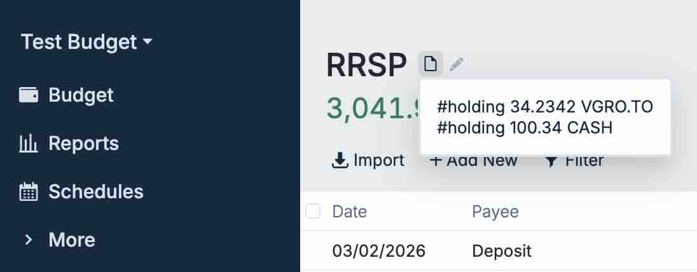

# Usage Examples

## Backup script

**Description:** A bash script to back up the Actual budget into a desired destination.

**Location:** [budget_backup.sh](./budget_backup.sh)

Update these variables in the script:
```bash
ACTUAL_BUDGET_URL="..."
ACTUAL_BUDGET_API_KEY="..."
ACTUAL_BUDGET_SYNC_ID_LIST=("...")
```

Grant permissions and run the script:
```bash
chmod +x budget_backup.sh
./budget_backup.sh
```

Schedule the script to run daily via cron (Linux/macOS) or Task Scheduler (Windows).

## Fly deployment (fly.toml)

**Description:** Example `fly.toml` for deploying this service as a Docker container on Fly.io.

**Required secrets:** `ACTUAL_SERVER_PASSWORD`, `API_KEY` (create these in the Fly console or via `fly secrets`).

**Location:** [fly.toml](./fly.toml)

## Update Investment Account Balances

> [!NOTE]
> This script can only be used with actual-http-api version 26.4.0 and onwards.

**Description:** Example python script to update your investment account balances in Actual Budget.

**Location:** [update_account_balances.py](./update_account_balances.py)

Go to each of your investment accounts (Off budget) and add a note specifying the holdings you have, including any cash. For example:

```
#holding 34.2342 VGRO.TO
#holding 100.34 CASH
```



Update these variables in the script:
```python
BASE_URL = "..."
BUDGET_SYNC_ID = "..."
API_TOKEN = "..."
PAYEE_NAME = ""  # optional, defaults to empty
```

Install the script dependencies:

```bash
# Install dependencies globally (not recommended on system Python):
pip install requests yfinance

# OR using a virtual environment (recommended):
python3 -m venv venv
source venv/bin/activate
pip install requests yfinance
```

And run the script:

```bash
python update_account_balances.py
```

Finally, schedule the script to run daily via cron (Linux/macOS) or Task Scheduler (Windows).
